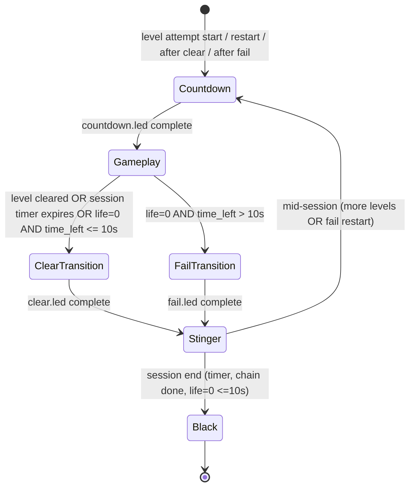

# LED Laser — Effects Implementation Plan

**Status:** Plan only (no code changes in this commit)  
**Spec:** [EFFECTS_SPEC.md](./EFFECTS_SPEC.md) · **Global rules:** [GLOBAL_RULES.md](../../docs/game-effects/GLOBAL_RULES.md)  
**Flow diagram:** [assets/laser-effects-flows.png](./assets/laser-effects-flows.png)

---

## Plan review (2026-08-07)

**Verdict:** **Ready** — architecture and locked rules align with spec and `game_manager.py`; revisions below close loop-structure and sync gaps found in review.

### Findings

| Severity | Finding |
|----------|---------|
| **Blocker** | §3.3 pseudocode placed countdown only at the outer `for lvl_path` entry. Fail restarts use the inner `while True: continue`, so per-attempt countdown would be skipped on life restarts. |
| **High** | No input gating during effect phases — wall/floor presses can still invoke scoring while `countdown.led` / `clear.led` / `fail.led` runs. |
| **High** | Score SFX (positive/negative MP3) absent from audio architecture; only BGM/stinger/tick covered. |
| **High** | Stinger sequencing unspecified — floor would go black between effect end and next countdown unless last effect frame is held during stinger. |
| **Medium** | `clear.led` anchor used col 5; [EFFECTS_SPEC.md](./EFFECTS_SPEC.md) and diagram specify **col 6** (row 3 center). |
| **Medium** | Level-1 double countdown risk (frontend `CountdownScreen` + backend `countdown.led`) needs a single owner decision before implementation. |
| **Medium** | State diagram showed “optional stinger” on session-end path; GLOBAL_RULES require stinger on all transitions. |
| **Low** | Board-time level advance (`total_pass > board_time_sec`) not listed in integration tests. |
| **Low** | `models.py` `GameState` is a thin WS envelope; `phase` / `countdown_label` live in `data` dict via `update_state()`. |

### Revisions applied

- Moved countdown to **inside** the inner restart `while True` loop (every attempt, including fail restarts).
- Added **input gating** (`accepting_input=False`) during all non-gameplay phases.
- Added **score SFX** hooks to audio module and gameplay callback.
- Clarified **stinger runs after** effect `.led` completes; hold last effect frame (or re-draw final group) during stinger.
- Aligned `clear.led` cell map to **col 6** per spec.
- Split session-end flow: `transition_clear` → stinger → `black` (no countdown); stinger required.
- Locked **life=0 with ≤10 s left** → `clear.led` only (session end), not `fail.led`.
- Documented frontend countdown ownership and `GameState.data` field placement.

### Open decisions (human)

| # | Decision | Recommendation |
|---|----------|----------------|
| 1 | Remove pre-session `CountdownScreen` or keep as loading splash? | **Remove digit sync** — Login → Simulator; backend owns 3-2-1-GO on floor + UI overlay via `phase`. |
| 2 | Transition stinger asset | Stock ~2–3 s MP3 until final asset (GLOBAL_RULES TBD). |
| 3 | Fail flicker authoring | **Three fixed sparse frames** at 0.30 / 0.35 / 0.40 s (spec “random” → authored, not runtime random). |
| 4 | Life=0 with ≤10 s: fail animation? | **No** — use `clear.led` + stinger + black (matches timer-expire session-end treatment). |

---

## 1. Executive summary

Wire marathon session transitions through **authored `.led` mini-levels** (countdown, clear, fail) using the **same load + `Play.running()` path** as gameplay. Add a **non-blocking audio layer** (BGM only during active level play; tick/stinger/SFX otherwise). Sync the React UI countdown with floor patterns via a published **session phase** in game state.

**Locked decisions (must not contradict):**

| Decision | Requirement |
|----------|-------------|
| Transition panels | `.led` mini-levels under `games/source/effects/` |
| Playback engine | Reuse `_load_level_file()` + `Play.running()` |
| Marathon countdown | Before **every** level start (first, after clear, after fail restart) |
| Fail path | All lives lost (with time to restart) → `fail.led` → stinger → countdown → same level |
| Clear path | Level cleared (mid-session) → `clear.led` → stinger → countdown → next level |
| Timer expire | Session end → `clear.led` → stinger → all black — **no countdown** |
| Life=0, ≤10 s left | Session end → `clear.led` → stinger → black — **no** `fail.led`, **no countdown** |
| Audio | Non-blocking; **no waits** on the game thread |
| BGM | Only during gameplay `Play.running()` |
| Score SFX | Positive/negative MP3 on score/life events during gameplay only |
| Input | Wall/floor input **disabled** during countdown, clear, fail, stinger |
| Patterns | Multi-phase timed `floor_light` groups in `.led` — not ad-hoc paint loops |

---

## 2. Audit — current state

### 2.1 What exists and works

| Area | Finding |
|------|---------|
| **Marathon loop** | `api/game_manager.py` `_run_game()` iterates `level_sequence`, persists score/life/session timer across levels, reloads `.led` each attempt. |
| **Level load** | `_load_level_file(path)` unzips, opens shelve, picks main gameplay shelve (`play_order=False`), returns `(dict_group, game_obj)`. |
| **Playback** | `Play.running(dict_group)` advances `total_pass`, gates groups by `[start_time_sec, end_time_sec]`, paints `FLOOR_LIGHT` via `set_color_table_by_set_cell`, invokes frame callback. |
| **Grid** | 6×16 from `led_parameter` (`value_high=6`, `value_width=16`). Working lasers cols **0–11**; cols **12–15** dead (no groups should target them). |
| **Level clear detection** | All scoreable `WALL_LIGHT` targets consumed → `_level_cleared=True`. Also board-time advance via `total_pass > board_time_sec`. |
| **Life restart** | `life<=0` with **>10 s** session time left → `_restart_level=True`, HP refill, replay same level. |
| **Session end** | Timer (`session_elapsed > game_time_sec`) → `result=2`; life=0 with ≤10 s left → `result=0`. Both set `_session_over=True`. |
| **HW blank** | `_hw_blank_floor()` at session/stop/crash paths. |
| **Frontend flow** | Login → **one** `CountdownScreen` (3-2-1-GO, Web Audio beeps) → `SimulatorScreen` starts backend via `/start-game`. |
| **Frontend sim audio** | Synth beeps on score/life change in `SimulatorScreen.jsx` only — not tied to transitions. |

### 2.2 Gaps (effects not implemented)

| Gap | Evidence | Impact |
|-----|----------|--------|
| **No effect `.led` files** | No `games/source/effects/` directory; no `countdown.led`, `clear.led`, `fail.led`. | Floor stays black / last gameplay frame during transitions. |
| **No transition hooks in marathon** | Session loop jumps directly `_load_level_file` → `play.running()` with no intermediate phases. | Violates GLOBAL_RULES flow. |
| **Countdown UI once per session** | `App.jsx`: `COUNTDOWN` screen only before first simulator mount; backend never drives per-level countdown. | UI/floor desync after level 1. |
| **Backend audio mocked** | `game_manager.py` mocks `pygame`, `audio_play` at import. | No BGM/stinger/tick on server/HW path. |
| **Blocking audio in legacy code** | `GameMusic.waiting_running()` spins on `mixer.music.get_busy()` — **must not** call from game thread. | Reference only; do not port blocking waits. |
| **Original end-fragments unused** | `Game.game_accomplished`, `Game.clap_light` exist in model; GAPS.md marks win/lose fragments ❌. | Replaced by dedicated effect `.led` files per locked decision. |
| **No session phase in API state** | `current_state.data` has no `phase` / `countdown_label` field. | Frontend cannot sync overlay with floor digits. |
| **No input gating flag** | `press_wall` / sim input always active during `Play.running()`. | Scoring could fire during effect playback unless gated. |
| **Pre-session vs per-level countdown** | Frontend countdown runs **before** `/start-game`; backend has no countdown for level 2+. | Double-countdown risk on level 1 unless coordinated. |

### 2.3 Reusable primitives (do not reimplement)

```text
_load_level_file(path)          → (dict_group, game_obj)
Play.running(dict_group)        → timed group playback loop
Play.update()                   → paints in-time FLOOR_LIGHT groups
HeadlessLedTable                → 6×16 floor + wall arrays
_frame_callback                 → scoring, HW draw, state publish (gameplay only)
```

### 2.4 Edge cases to preserve

| Case | Current behavior | Planned effect |
|------|------------------|----------------|
| Life=0, >10 s left | Restart same level | `fail.led` → stinger → countdown → restart |
| Life=0, ≤10 s left | Session end (`out_of_life`) | `clear.led` → stinger → black (no fail animation, no countdown) |
| Timer expires mid-level | Callback returns False, `_session_over` | `clear.led` → stinger → black (no countdown) |
| Timer expires between levels | Loop checks `session_elapsed` before next level | Same clear path, skip countdown |
| Last level cleared, time remains | Loop exits, `result=1` | After clear.led + stinger: **no countdown** (no next level) — treat as session wind-down then black |
| Unloadable level | Skip with warning | No effect; continue sequence |
| Group mode | Same marathon from `source_group/` | Same effect files (shared `effects/`) |

---

## 3. Target architecture

### 3.1 Session phase state machine



**Phase enum** (publish in `current_state.data.phase` via `update_state()`):

| Phase | Floor | UI | Audio |
|-------|-------|-----|-------|
| `countdown` | `countdown.led` | 3 / 2 / 1 / GO overlay | Tick SFX per second, no BGM |
| `gameplay` | Level `.led` | Simulator HUD | BGM loop + score ± SFX |
| `transition_clear` | `clear.led` | Optional “Level clear!” | Stinger queued after effect, no BGM |
| `transition_fail` | `fail.led` | Optional “Try again” | Stinger queued after effect, no BGM |
| `stinger` | Hold last effect frame | Transition message | Stinger ~2–3 s, no BGM |
| `black` | All off | Result / idle | Silence |

### 3.2 Effect playback helper (new)

Add to `api/game_manager.py` (or `api/effects_runner.py`):

```python
def _play_effect_led(path, led_table, play, publish_cb, *, scoring=False, accepting_input=False):
    """
    Load effect .led, run Play.running() with a lightweight callback.
    - scoring=False: no wall scoring, no life changes
    - accepting_input=False: ignore press_wall / sim input during effect
    - publish_cb: pushes floor_display + phase to current_state each frame
    - Returns when Play.running() exits (natural end = max group end_time)
    """
```

**Differences from gameplay callback:**

- No `vary_with_color_state`, no `score_wall_light_groups`, no level-clear detection.
- Set `game.accepting_input = False` for entire effect; restore `True` only when gameplay starts.
- Still call `redraw_led_table_default` + HW draw (`_hw_led_control.draw_screen_by_com`) so sim/HW see patterns.
- Map `total_pass` → `countdown_label` (`"3"|"2"|"1"|"GO"`) during `countdown.led` (see §4.2).
- Mirror gameplay pacing (`time.sleep(0.01)` in callback) so `total_pass` timing matches authored windows.
- `play.game_level_speed = 1.0` (effects are authored at real-time seconds).

### 3.3 Marathon loop integration (pseudocode)

Insert into `_run_game()` session loop. Countdown runs **inside** the inner restart `while True` (every attempt), not only when advancing levels:

```python
EFFECTS = GAMES_ROOT / "source" / "effects"

def _run_countdown():
    game.accepting_input = False
    game.update_state(phase="countdown")
    _play_effect_led(EFFECTS / "countdown.led", ...)
    audio.stop_bgm()

def _run_clear():
    audio.stop_bgm()
    game.accepting_input = False
    game.update_state(phase="transition_clear")
    _play_effect_led(EFFECTS / "clear.led", ...)
    _run_stinger()  # hold last clear frame on floor during stinger

def _run_fail():
    audio.stop_bgm()
    game.accepting_input = False
    game.update_state(phase="transition_fail")
    _play_effect_led(EFFECTS / "fail.led", ...)
    _run_stinger()

def _run_stinger():
    game.update_state(phase="stinger")
    audio.play_stinger("transition_stinger.mp3")  # non-blocking; ~2-3 s worker-side

def _run_session_end_clear():
    _run_clear()  # includes stinger; no countdown after
    game.update_state(phase="black")
    _hw_blank_floor()

for lvl_path in game.level_sequence:
    if game._session_over or not game.running:
        break
    if session_time_remaining() <= 0:
        game._session_over = True
        game._end_reason = "timeout"
        break

    while True:  # restart loop — same level on fail
        if game._session_over or session_time_remaining() <= 0:
            break

        _run_countdown()
        audio.start_bgm(BGM_PATH)
        game.accepting_input = True

        play.running(dg)  # existing gameplay; stop_bgm at first line of any post-play branch

        audio.stop_bgm()
        game.accepting_input = False

        if game._session_over:
            if game._end_reason in ("timeout", "out_of_life"):
                _run_session_end_clear()
            else:
                _hw_blank_floor()
            break

        if game._restart_level:
            _run_fail()
            game.life = game.max_life
            # reset hazard timers (existing)
            continue  # → _run_countdown() at top of while True

        if game._level_cleared:
            _run_clear()
            if more_levels_in_sequence() and session_time_remaining() > 0:
                break  # outer for → next level → while True → _run_countdown()
            else:
                game.update_state(phase="black")
                _hw_blank_floor()
                game._session_over = True
            break

    if game._session_over:
        break
```

### 3.4 Frontend sync

**Problem:** `CountdownScreen` runs once pre-session; backend will run per-level countdown.

**Recommended approach (open decision #1):**

1. **Skip pre-session digit countdown** — Login → `SimulatorScreen` → `/start-game`; backend `countdown.led` is authoritative for floor digits.
2. **Add overlay in `SimulatorScreen`** driven by `gameState.phase === 'countdown'` and `gameState.countdown_label` (`"3"|"2"|"1"|"GO"`).
3. **Backend derives label** from `total_pass` during `countdown.led` playback (see §4.2 timing table); queue tick SFX at each second boundary in the effect callback.

Alternative (not preferred): re-mount `CountdownScreen` between levels via `phase` WebSocket push — heavier navigation churn.

### 3.5 Non-blocking audio architecture

```text
┌─────────────────┐     queue      ┌──────────────────┐
│ Game thread     │ ──────────────► │ AudioWorker      │
│ (marathon loop) │  play/stop/cmd  │ (daemon thread)  │
└─────────────────┘                 │ pygame.mixer     │
                                    └──────────────────┘
```

**New module:** `api/audio_manager.py` (or `games/audio_play/effect_audio.py` un-mocked)

| Method | Behavior | Thread |
|--------|----------|--------|
| `start_bgm(path, loops=-1)` | `mixer.music.load/play` | Worker |
| `stop_bgm()` | `mixer.music.stop` | Worker |
| `play_sfx(path)` | `Sound.play()` on free channel (score ±, tick) | Worker |
| `play_stinger(path)` | One-shot after effect `.led` completes | Worker |
| `tick_on_second(n)` | Queued from effect callback at 3/2/1 boundaries | Queue only |

**Gameplay score SFX:** In `_frame_callback`, detect score/life delta vs previous frame; queue positive or negative MP3 via `play_sfx()`. Do not play score SFX during effect phases.

**Rules:**

- Game thread **never** calls `time.sleep` waiting for audio (except existing ~10 ms frame pacing in callbacks).
- Game thread **never** calls `get_busy()` + spin loop.
- Stop BGM **before** clear/fail/countdown effects.
- Start BGM **after** countdown effect completes, **before** gameplay `Play.running()`.
- During `stinger` phase, **hold the last effect frame** on floor/HW (re-publish final `floor_display`) until stinger ends or session goes black.
- In headless/sim-only mode (`USE_SERIAL_HD=0` and no pygame): audio no-op with debug log; frontend Web Audio may mirror tick/score optionally.

**Asset placeholders** (per EFFECTS_SPEC):

| Asset | Path (proposed) |
|-------|-----------------|
| BGM | `games/audio_play/squid_game_remix.mp3` (or setting override) |
| Positive SFX | Shared cross-game MP3 |
| Negative SFX | Shared cross-game MP3 |
| Countdown tick | Stock tick/noise MP3 |
| Transition stinger | `games/audio_play/transition_stinger.mp3` (TBD OK) |

---

## 4. `.led` authoring — multi-phase patterns

### 4.1 Encoding model

Each visual **phase** = one or more `Group` entries in `dict_group`:

| Field | Effect value | Notes |
|-------|--------------|-------|
| `type` | `floor_light` | Paints floor cells |
| `color` | `(0, 254, 0)` (`Color.GREEN`) | Spec: green dots |
| `speed` | `0` | Static pattern |
| `direct` | `static` | No movement |
| `edge_run_into` | `disappear` | Default |
| `start_member` | `[(row, col), ...]` | Only cols 0–11 |
| `activity_area` | `[(0, 6), (0, 12)]` | Working floor |
| `start_time_sec` / `end_time_sec` | Non-overlapping windows | **Phase timing** |
| `start_area` | `1` | Floor (not wall column) |

**Total effect duration** = `max(end_time_sec)` across all groups.

**Shelve structure** (matches existing levels):

```text
countdown.led (zip)
  countdown/game_file.{dat,dir,bak}     ← dict_group + para_key_game
  countdown/...                       ← optional embedded mp3 (not used if global audio)
```

Set `para_key_game.play_order = False` on the effect `Game` object so `_load_level_file` selects it as main.

### 4.2 `countdown.led` (~4.5–5.5 s total)

Align with EFFECTS_SPEC + diagram (`laser-effects-flows.png`):

| Phase | Time window (s) | Cells (row, col) | Display |
|-------|-----------------|------------------|---------|
| 1 | 0.0 – 1.0 | Digit **3** bitmap, centered in cols 0–11 | ~1 s |
| 2 | 1.0 – 2.0 | Digit **2** | ~1 s |
| 3 | 2.0 – 3.0 | Digit **1** | ~1 s |
| 4 | 3.0 – 5.0 | Letters **G** + **O** side by side | ~1.5–2 s |

**Digit bitmap authoring:** Use diagram coordinates. Example anchor: center col ~5–6, row 3. Each digit is a set of 8–20 cells. Author in level editor or Python builder script.

**Backend sync helper:**

```python
def _countdown_label(total_pass):
    if total_pass < 1.0: return "3"
    if total_pass < 2.0: return "2"
    if total_pass < 3.0: return "1"
    return "GO"
```

Adjust thresholds to match authored `end_time_sec` boundaries exactly.

### 4.3 `clear.led` (~2.3–3.1 s)

Align with [EFFECTS_SPEC.md](./EFFECTS_SPEC.md) center at **row 3, col 6**:

| Phase | Time (s) | Pattern |
|-------|----------|---------|
| 1 | 0.0 – 0.4 | Single dot @ (3, 6) |
| 2 | 0.4 – 0.8 | Small `+` (~5 dots) centered on (3, 6) |
| 3 | 0.8 – 1.2 | Full height col 6 + full width row 3 |
| 4 | 1.2 – 1.6 | All working cells (72 dots: 6×12) |
| 5 | 1.6 – 3.0 | Hold full matrix |

Phase 4–5 may use two groups: one toggles from cross to full at 1.2 s; hold group 1.6–3.0 s.

### 4.4 `fail.led` (~1.7–2.5 s)

| Phase | Time (s) | Pattern |
|-------|----------|---------|
| 1 | 0.0 – 0.3 | All working cells ON |
| 2 | 0.3 – 0.6 | Three fixed sparse flicker frames at 0.30 / 0.35 / 0.40 s (~8–12 dots each) |
| 3 | 0.6 – 0.9 | Center 3×3 block (~rows 2–4, cols 4–7) |
| 4 | 0.9 – 1.2 | 3–4 dots (diagram: e.g. (5,0), (3,7), …) |
| 5 | 1.2 – 2.0 | All OFF (empty groups or black fill) |

**Flicker note:** Spec says “random flicker”; author **three fixed sparse frames** at 0.30 s, 0.35 s, 0.40 s (open decision #3). Do **not** use Python random in the game loop.

### 4.5 Authoring workflow

1. **Option A — Level editor:** Use existing GUI editor to paint groups, set time windows, export `.led`.
2. **Option B — Builder script:** `scripts/build_effect_led.py` reads JSON phase definitions → writes shelve → zips to `.led`. Preferred for repeatable pixel-perfect digits.

**Validation script:** `scripts/validate_effect_led.py` — load each effect, assert:
- Duration within spec tolerance
- All cells in cols 0–11
- No `wall_light` groups (floor-only effects)
- Exactly one `play_order=False` game shelve

### 4.6 Dead columns

Never light cols 12–15. Optionally add no-op groups there — better to omit entirely so `clear_led_table` + partial groups stay clean.

---

## 5. File tasks

### 5.1 New files

| File | Purpose |
|------|---------|
| `games/source/effects/countdown.led` | Multi-phase 3-2-1-GO |
| `games/source/effects/clear.led` | Expanding `+` clear |
| `games/source/effects/fail.led` | Collapse/flicker fail |
| `games/source/effects/README.md` | Cell maps, timing, regen instructions |
| `api/audio_manager.py` | Non-blocking pygame audio worker |
| `api/effects_runner.py` | `_play_effect_led`, phase helpers (optional split) |
| `scripts/build_effect_led.py` | JSON → `.led` builder |
| `scripts/validate_effect_led.py` | Load/duration/bounds checks |
| `scripts/smoke_effects.py` | Headless play each effect, dump frame count |

### 5.2 Modified files

| File | Changes |
|------|---------|
| `api/game_manager.py` | Phase state machine; call effects before/after gameplay; `accepting_input` gating; un-mock audio when available; publish `phase`, `countdown_label` in state `data`; BGM + score SFX lifecycle |
| `api/models.py` | Document `phase`, `countdown_label`, `transition_reason` in `GameState.data` schema comment (fields flow via dict, not new Pydantic attrs) |
| `api/main.py` | Pass through new state fields (automatic if dict-based) |
| `frontend/src/App.jsx` | Gate or remove pre-session `CountdownScreen` when backend owns countdown |
| `frontend/src/screens/SimulatorScreen.jsx` | Countdown overlay from `phase`; optional stinger on transition |
| `frontend/src/index.css` | Overlay styles for in-sim countdown |
| `ws_bridge.py` | Forward new state fields to simulator iframe |
| `simulator/static/index.html` | Show phase if needed on HW sim |
| `docs/STATUS.md` | Mark effects implemented |
| `docs/GAPS.md` | Close end-fragment gap |

### 5.3 Config / assets

| Item | Action |
|------|--------|
| BGM MP3 | Add or symlink Squid Game remix |
| Shared ± score SFX | Copy from cross-game asset pack |
| Stinger / tick | Stock placeholders until final |
| `led_parameter` | No layout change (6×16 confirmed) |

---

## 6. Risks and mitigations

| Risk | Severity | Mitigation |
|------|----------|------------|
| **Double countdown** (frontend + backend on level 1) | Medium | Single owner: remove pre-session digits; backend + overlay reads `phase` (open decision #1) |
| **Input during transitions** | High | `accepting_input=False` on all effect/stinger phases; guard `press_wall` / sim handlers |
| **Blocking audio freezes floor** | High | Code review ban on `waitting_music_end` / `get_busy` loops in game thread |
| **pygame mocked in API** | High | Conditional import: real `AudioManager` when pygame installed; mock only in CI unit tests |
| **Effect duration drift** | Medium | Author with `end_time_sec` margins; validate with smoke script; tune against reference MP4 |
| **HW draw rate during effects** | Low | Reuse `_HW_DRAW_INTERVAL` gate in effect callback |
| **Life=0 threshold (10 s)** | Low | Document: >10 s = fail+restart; ≤10 s = session-end clear (no fail animation) — matches current code |
| **Large clear.led (72 cells)** | Low | Static groups only; no perf concern at 6×12 |
| **Editor/manual `.led` drift** | Medium | Prefer JSON builder script as source of truth |
| **Group mode / single mode parity** | Low | Share same three effect files |

---

## 7. Test plan

### 7.1 Unit / script tests

- [ ] `validate_effect_led.py` passes for all three files
- [ ] All effect cells satisfy `0 <= col <= 11`
- [ ] `countdown.led` duration 4.5–5.5 s; labels at 0.5, 1.5, 2.5, 4.0 s correct
- [ ] `clear.led` / `fail.led` duration ~2–3 s

### 7.2 Integration (headless API)

- [ ] Start session → observe `phase`: countdown → gameplay → (mock clear) → countdown → gameplay
- [ ] Clear last wall target → `transition_clear` → countdown → next level id in state
- [ ] Drain lives with time left → `transition_fail` → stinger → countdown → same level id, life refilled
- [ ] Board-time level end (`total_pass > board_time_sec`) → clear path → countdown → next level
- [ ] Let timer expire → `clear.led` → stinger → black → `game_over`, **no** countdown phase after clear
- [ ] Life=0 with ≤10 s left → `clear.led` only (no `fail.led`), then black
- [ ] BGM: verify `start_bgm` only when `phase=gameplay` (log markers)
- [ ] Score SFX: positive/negative MP3 fire on score/life change during gameplay only
- [ ] Wall input ignored when `accepting_input=False` during countdown/clear/fail

### 7.3 Frontend

- [ ] Simulator overlay shows 3-2-1-GO in sync with `countdown_label` polling
- [ ] No standalone `CountdownScreen` duplicate on level 1 (or explicitly documented exception)

### 7.4 Hardware / sim

- [ ] `USE_SERIAL_HD=1`: patterns visible on 6×16 floor; cols 12–15 stay dark
- [ ] ws_bridge simulator receives `floor_display` during countdown phases
- [ ] Session stop → floor blanks

### 7.5 Reference media

- [ ] Side-by-side with `~/Downloads/Laser Escape/` capture — adjust phase timings in JSON source if pace feels off

---

## 8. Implementation order

1. **Author `.led` files** (JSON builder + validate script) — can parallel with audio setup
2. **`effects_runner` + `_play_effect_led`** — headless, no audio
3. **Marathon loop hooks** — phase publishing
4. **`AudioManager`** — wire BGM/stinger/tick
5. **Frontend overlay** — remove duplicate countdown
6. **HW smoke** — full session on sim + serial
7. **Tune timings** against reference media

---

## 9. Out of scope (this plan)

- Idle/attract video (`game_idle_video`)
- Per-level embedded mp3 inside `.led` zips (use global audio manager instead)
- Ad-hoc Python paint loops as primary effect mechanism
- Timer-expire → next level (explicitly forbidden by global rules)
- Multiplayer / 2P effects (Laser is 1P only)

---

## 10. References

| Doc | Path |
|-----|------|
| Global rules | `docs/game-effects/GLOBAL_RULES.md` |
| Laser effects spec | `docs/EFFECTS_SPEC.md` |
| Grid matrices | `docs/game-effects/GRID_MATRICES.md` |
| Known gaps | `docs/GAPS.md` |
| Marathon loop | `api/game_manager.py` (`_run_game`, `_load_level_file`) |
| Playback engine | `games/game_play/Play.py` |
| Group model | `games/model/group.py` |
| Legacy audio (blocking — avoid) | `games/game_play/game_music.py` |
