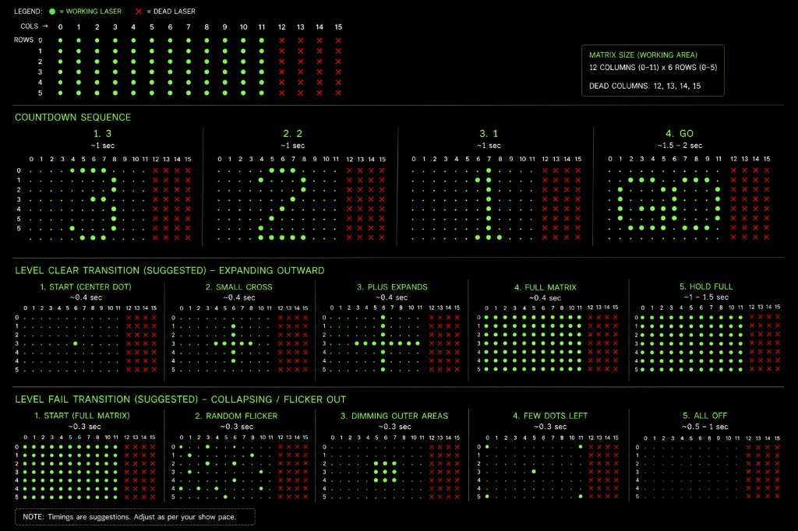

# LED Laser — effects spec

Audio, countdown, and laser-grid behavior for **LED Laser Escape**.

Global rules: [activerse_final_changes/docs/game-effects/GLOBAL_RULES.md](../../docs/game-effects/GLOBAL_RULES.md)

---

## Grid layout

| Dimension | Value |
|-----------|-------|
| Grid size | **6 rows × 16 columns** |
| Working lasers | Columns **0–11**, rows **0–5** |
| Dead zone | Columns **12–15** — no use |

### Effects flow diagram

---

## Audio assets

| Asset | File / source |
|-------|---------------|
| **BGM** | Squid Game remix — level play only |
| **Positive score SFX** | Shared positive MP3 (cross-game) |
| **Negative score SFX** | Shared negative MP3 (cross-game) |
| **Countdown** | Tick/noise during 3-2-1; **no BGM** |
| **Level transition** | Short stinger ~2–3 s (asset TBD / stock OK) |

---

## Countdown (every level start)

Runs before **every level** — first level of the session, after level clear,
and after level fail restart. **Not** repeated when the session has ended.

~**1 s per step**. Tick/noise audio; no BGM. Digits/letters rendered in **green dots** centered in the working area (cols 0–11).

| Step | Display | Duration |
|------|---------|----------|
| **3** | Digit **3** centered | ~1 s |
| **2** | Digit **2** centered | ~1 s |
| **1** | Digit **1** centered | ~1 s |
| **GO** | Letters **G** + **O** side by side | ~1.5–2 s |

UI countdown and laser grid stay in sync.

---

## Level clear (mid-session)

Total animation **~2–3 s**, then **countdown**, then next level play.

| Phase | Duration | Visual |
|-------|----------|--------|
| 1 | ~0.4 s | Single dot at row 3, col 6 |
| 2 | ~0.4 s | Small **+** (~5 dots) |
| 3 | ~0.4 s | Full vertical col 6 + horizontal row 3 |
| 4 | ~0.4 s | All working lasers **ON** |
| 5 | ~1–1.5 s | Hold full matrix |

If more levels remain: clear animation → stinger → **countdown** → next level.

---

## Timer expire (= session end)

Same LED treatment as **level clear** (expanding-outward animation).

1. Clear animation + ~2–3 s stinger (not BGM)
2. All lasers **black / off**
3. **No countdown** — session is over

---

## Level fail

Triggered when **all lives are lost**.

Total animation **~2–3 s**, then **countdown**, then same level restart play.

| Phase | Duration | Visual |
|-------|----------|--------|
| 1 | ~0.3 s | Full matrix **ON** |
| 2 | ~0.3 s | Random flicker (sparse) |
| 3 | ~0.3 s | Center **~3×3** block |
| 4 | ~0.3 s | **3–4** random dots |
| 5 | ~0.5–1 s | All **off** |

---

## Reference media

Capture and timing reference: **`~/Downloads/Laser Escape/`**

Use for laser pattern design only — not frontend video playback.
